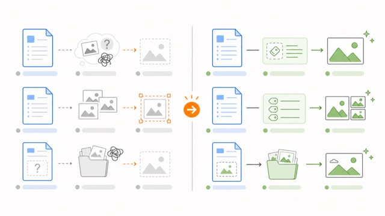
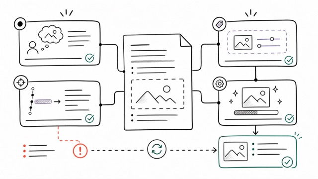

<div align="center">
  <p><a href="README.md">中文</a> | <strong>English</strong></p>
  <h1>zu-article-image-skill</h1>
  
  <p><strong>Add semantic illustrations to Markdown articles: draft editable prompts first, then generate images and write them back into the article.</strong></p>
</div>

## Core Design

This skill focuses on two decisions only:

1. Where an illustration should appear
2. What kind of illustration it should be

It separates the workflow into two layers:

1. **Prompt layer**: analyze the article structure first, then insert reviewable and editable pre-render illustration prompt tags into the Markdown body.
2. **Image layer**: after the user confirms the prompts, generate images from those prompts, save them under `imgs/`, and insert the image references back at the original positions.

The Markdown article is the single source of state. The workflow does not create separate plan files, standalone prompt files, task JSON, or any other state files.

## Technical Approach

### Intermediate Tags

The first pass only writes hidden tags. It does not generate images:

```markdown
<!-- article-illustration id="01-agent-runtime" preset="process-flow" type="flowchart" style="sketch-notes" palette="macaron" ratio="16:9" alt="Agent execution flow"
Create a horizontal flowchart for a technical article that helps readers understand the execution chain of an Agent request from input to output.

Layout: Five left-to-right stages with generous whitespace across the canvas.
Content: User input, Router, Planner, Executor, Validator, and final answer.
Style: sketch-notes educational infographic style, warm paper background, black hand-drawn lines.
Palette: macaron. Use light blue for system modules, mint green for successful output, and coral red only for risk callouts.
Text: Use short Chinese labels only, with large and clearly readable typography.
Aspect: 16:9.
-->
```

`preset/type/style/palette/ratio/alt` are readable metadata. The actual image generation input is the full natural-language prompt inside the tag body.

### Built-in Style System

The agent uses the rules in `references/` to select styles automatically. Users can also specify or edit the style choices manually.

| Layer | Count | Purpose |
| --- | ---: | --- |
| `preset` | 8 | Common scenario bundles, such as knowledge maps, architecture diagrams, flowcharts, and comparison diagrams |
| `type` | 6 | Information structure: `infographic`, `flowchart`, `comparison`, `framework`, `scene`, `timeline` |
| `style` | 7 | Visual language: hand-drawn, blueprint, vector, whiteboard, editorial, poster, and warm scene illustration |
| `palette` | 6 | Color semantics: soft education, technical blue, balanced, black-and-white ink, two-color poster, and warm tones |

Current built-in presets:

`hand-drawn-edu`, `tech-blueprint`, `process-flow`, `side-by-side`, `ink-notes`, `editorial-data`, `poster-opinion`, `warm-scene`

### Illustration Style Preview

The preview images use the same theme, "Markdown article illustration workflow", and are generated with the built-in `style` options.

<table>
  <tr>
    <td align="center" width="50%">
      <br>
      <strong>sketch-notes</strong><br>
      Hand-drawn educational infographics for concepts, tutorials, and process explanations.
    </td>
    <td align="center" width="50%">
      <br>
      <strong>blueprint</strong><br>
      Technical blueprint visuals for architecture, system boundaries, and data flows.
    </td>
  </tr>
  <tr>
    <td align="center" width="50%">
      <br>
      <strong>vector-illustration</strong><br>
      Flat vector illustrations for solution comparisons and knowledge cards.
    </td>
    <td align="center" width="50%">
      <br>
      <strong>ink-notes</strong><br>
      Whiteboard-note visuals for methodologies, frameworks, and shifts in thinking.
    </td>
  </tr>
  <tr>
    <td align="center" width="50%">
      <br>
      <strong>editorial</strong><br>
      Magazine-style infographics for data, metrics, and report summaries.
    </td>
    <td align="center" width="50%">
      <br>
      <strong>screen-print</strong><br>
      Screen-printed poster visuals for strong opinions and symbolic hero images.
    </td>
  </tr>
  <tr>
    <td align="center" width="50%">
      <br>
      <strong>warm</strong><br>
      Gentle narrative illustrations for personal experience and light metaphor.
    </td>
    <td width="50%"></td>
  </tr>
</table>

### State Machine

`scripts/article_tags.py` performs deterministic scanning and insertion:

| Command | Purpose |
| --- | --- |
| `scan` | Parse tags, validate attributes, and output the state and save path for each image |
| `sync` | When an image already exists, insert `` immediately after the corresponding tag |

State meanings:

| State | Meaning |
| --- | --- |
| `needs_generation` | The tag exists, but `imgs/{id}.png` does not |
| `needs_insertion` | The image exists, but the article does not yet contain the image reference |
| `complete` | Both the image file and image reference exist |
| `error` | The tag is invalid, the ID is duplicated, or the image reference is duplicated |

## Usage

Plan illustrations:

```text
Use zu-article-image-skill to plan illustrations for article.md
```

After the first pass, the skill summarizes the position, purpose, and style of each planned image. At this point, you can:

- Confirm and continue to image generation.
- Manually edit the prompt tags inside the article.
- Ask the agent to switch to another preset or style and regenerate the prompts.

Generate images and insert them back after confirmation:

```text
Generate images from the existing `article-illustration` tags in the article.
```

## Best For

- Chinese technical articles, tutorials, opinion pieces, and project retrospectives
- Markdown drafts that need flowcharts, architecture diagrams, concept maps, or comparison diagrams
- Authors who want illustration prompts to live directly inside the article instead of in separate configuration files

## Install for Claude Code / Codex

The skill source is the `zu-article-image-skill/` directory in the [`wwenj/zu-article-image-skill`](https://github.com/wwenj/zu-article-image-skill) repository.

- Claude Code: copy it to `~/.claude/skills/zu-article-image-skill/`
- Codex: copy it to `~/.agents/skills/zu-article-image-skill/`

You can also ask your agent to install it directly:

```text
Download the repository from https://github.com/wwenj/zu-article-image-skill, then install the `zu-article-image-skill/` directory into the current tool's personal Skill directory.
```

## Related Skill

After the article is finished and before adding illustrations, you can use the skill below to polish the article. It focuses on removing AI-like structure and phrasing so the writing feels closer to how a human engineer writes.

[zu-article-image-skill](https://github.com/wwenj/zu-article-image-skill)
