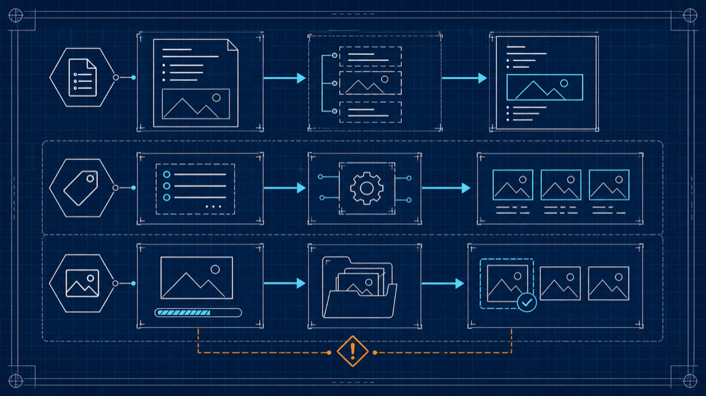
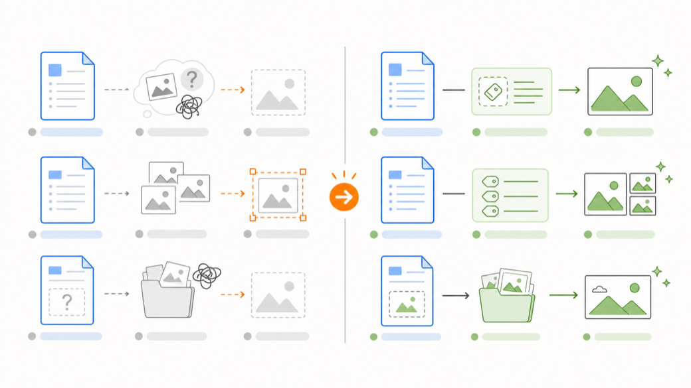

<div align="center">
  <h1>zu-article-image-skill</h1>
  
  <p><strong>给 Markdown 文章加语义配图：先生成可编辑 Prompt，再生成图片并回写正文。</strong></p>
</div>

## 核心设计

这个 skill 只解决两件事：

1. 在什么地方配插图
2. 配什么样的插图

它把流程拆成两层：

1. **Prompt 层**：先根据文章结构，在正文里插入可检查、可修改的插图预渲染 Prompt 标签。
2. **生图层**：用户确认后，再根据这些 Prompt 生成图片，保存到 `imgs/`，并把图片引用插回原位置。

文章 Markdown 是唯一状态源。不创建计划文件、独立 Prompt 文件、任务 JSON 或额外状态文件。

## 技术方案

### 中间态标签

第一次执行只写入隐藏标签，不生成图片：

```markdown
<!-- article-illustration id="01-agent-runtime" preset="process-flow" type="flowchart" style="sketch-notes" palette="macaron" ratio="16:9" alt="Agent 执行流程"
创建一张用于技术文章的横向流程图，帮助读者理解 Agent 请求从输入到输出的执行链路。

Layout: 从左到右的五段流程，整体保持充足留白。
Content: 用户输入、Router、Planner、Executor、Validator 和最终答案。
Style: sketch-notes 手绘教育信息图风格，暖色纸张背景，黑色手绘线条。
Palette: macaron。浅蓝表示系统模块，薄荷绿表示成功输出，珊瑚红只用于风险提示。
Text: 只使用中文短标签，保持大字号和清晰可读。
Aspect: 16:9。
-->
```

`preset/type/style/palette/ratio/alt` 是可读元数据；真正用于生图的是标签正文里的完整自然语言 Prompt。

### 内置样式体系

Agent 会参考 `references/` 中的规则自动选择样式，用户也可以指定或修改。

| 层级 | 数量 | 作用 |
| --- | ---: | --- |
| `preset` | 8 | 常用场景组合，例如知识图、架构图、流程图、对比图 |
| `type` | 6 | 信息结构：`infographic`、`flowchart`、`comparison`、`framework`、`scene`、`timeline` |
| `style` | 7 | 画面语言：手绘、蓝图、矢量、白板、编辑、海报、温和场景 |
| `palette` | 6 | 色彩语义：柔和教育、技术蓝、均衡、黑白墨线、海报双色、暖色 |

当前内置 preset：

`hand-drawn-edu`、`tech-blueprint`、`process-flow`、`side-by-side`、`ink-notes`、`editorial-data`、`poster-opinion`、`warm-scene`

### 插图风格预览

下面的预览图按当前 skill 的 Prompt 组件生成：`Purpose`、`Layout`、`Content`、`Style`、`Palette`、`Text`、`Aspect`。示例主题统一为“Markdown 文章配图 workflow”，便于比较不同风格的视觉差异。

| style | preset / type / palette | 示例图 Prompt 组件 | 预览 |
| --- | --- | --- | --- |
| `sketch-notes` | `hand-drawn-edu` / `infographic` / `macaron` | Purpose：解释两阶段配图 workflow。<br>Layout：五段横向流程。<br>Style：暖纸背景、黑色手绘线、圆角信息框。<br>Text：不使用可读文字，避免缩略图错字。 |  |
| `blueprint` | `tech-blueprint` / `framework` / `technical-blue` | Purpose：表达文章、Prompt、图片资产之间的系统边界。<br>Layout：三层工程架构和左到右数据流。<br>Style：蓝图网格、精确模块、规整连接线。<br>Text：只用图标和抽象占位。 |  |
| `vector-illustration` | `side-by-side` / `comparison` / `balanced` | Purpose：对比手工配图和结构化 Prompt 配图。<br>Layout：左右分栏，维度保持一致。<br>Style：平面矢量、几何形状、统一图标语言。<br>Text：不使用可读文字。 |  |
| `ink-notes` | `ink-notes` / `framework` / `mono-ink` | Purpose：展示插图位置选择的白板框架。<br>Layout：中心文档，四周决策框连接。<br>Style：白底黑线、手写标注感、少量强调色。<br>Text：用抽象线条替代文字。 |  |
| `editorial` | `editorial-data` / `infographic` / `balanced` | Purpose：用杂志信息图表达配图 workflow 的数据化摘要。<br>Layout：主数据面板、两个辅助面板和页脚条。<br>Style：强层级、清晰分区、出版物信息图。<br>Text：使用图表形状和占位条。 |  |
| `screen-print` | `poster-opinion` / `scene` / `poster-duotone` | Purpose：表达观点文配图的象征性主视觉。<br>Layout：中心抽象符号、大负空间、少量大色块。<br>Style：丝网印刷、粗颗粒、半调纹理、强剪影。<br>Text：纯图形，不放文字。 |  |
| `warm` | `warm-scene` / `scene` / `warm-soft` | Purpose：表达个人技术写作从草稿到配图的温和叙事。<br>Layout：桌面场景，草稿、Prompt 卡片和生成图形成单一路径。<br>Style：柔和光线、低对比、简洁背景。<br>Text：不使用可读文字。 |  |

### 状态机

`scripts/article_tags.py` 负责确定性扫描和回插：

| 命令 | 作用 |
| --- | --- |
| `scan` | 解析标签、校验属性、输出每张图的状态和保存路径 |
| `sync` | 在图片已存在时，把 `` 插回标签后方 |

状态含义：

| 状态 | 含义 |
| --- | --- |
| `needs_generation` | 标签存在，但 `imgs/{id}.png` 不存在 |
| `needs_insertion` | 图片存在，但文章里还没有图片引用 |
| `complete` | 图片文件和图片引用都存在 |
| `error` | 标签非法、ID 重复或图片引用重复 |

## 使用方式

规划配图：

```text
使用 zu-article-image-skill 为 article.md 规划配图
```

第一次执行结束后，skill 会总结每张图的位置、目的和样式。此时可以：

- 确认继续生成图片。
- 手动编辑文章里的 Prompt 标签。
- 要求换成其他 preset 或 style 后重新生成 Prompt。

确认后生成图片并回插：

```text
根据文章内已有 `article-illustration` 标签生成图片。
```

## 适合场景

- 中文技术文章、教程、观点长文、项目复盘
- 需要流程图、架构图、概念图、对比图的 Markdown 草稿
- 希望把配图 Prompt 直接维护在文章里，而不是拆到额外配置文件

## 安装到 Claude Code / Codex

Skill 来源是 [`wwenj/zu-article-image-skill`](https://github.com/wwenj/zu-article-image-skill) 仓库里的 `zu-article-image-skill/` 目录。

- Claude Code：复制到 `~/.claude/skills/zu-article-image-skill/`
- Codex：复制到 `~/.agents/skills/zu-article-image-skill/`

也可以直接让 Agent 安装：

```text
请从 https://github.com/wwenj/zu-article-image-skill 下载仓库，并把其中的 `zu-article-image-skill/` 目录安装到当前工具的个人 Skill 目录。
```

## 同类 Skill 关联推荐

文章完成后，插图前，可使用下面 Skill 做文章整理，主要针对去除 AI 味结构和语句，让文章更符合人类工程师写作习惯。

[zu-article-image-skill](https://github.com/wwenj/zu-article-image-skill)
