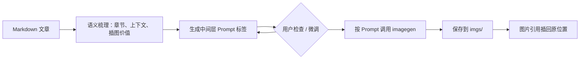

<div align="center">
  <h1>zu-article-image-skill</h1>
  
  <p><strong>把 Markdown 文章里的配图意图，直接变成可编辑、可生成、可同步的文章内 Prompt。</strong></p>
</div>

> 说明：这个 skill 的一部分设计参考了 [JimLiu/baoyu-skills](https://github.com/JimLiu/baoyu-skills) 中语义配图的思路。当前版本已经按我的 Codex 写作工作流做了简化，更适合中文技术文章、观点稿、项目复盘和教程类 Markdown 的正文配图。

zu-article-image-skill 是一个面向中文技术文章配图的 Codex skill。它不负责改写正文，也不维护额外配置层，而是围绕“生图提示词”建立一个中间层：先根据文章结构和上下文生成可编辑的配图 Prompt，再根据这些 Prompt 调用当前运行时原生 `imagegen` 生成图片并插回原位置。

## 核心理念：Prompt 中间层

给文章配图通常有两个极端做法，但都不稳定：

- **直接让模型根据文章生图**：输入成本低，但不确定性很高。模型可能选错重点、忽略上下文、误解段落关系，图片只要有一点不符合预期，就只能反复重新生成，问题也很难定位。
- **人工直接写生图提示词**：可控性更强，但成本很高。用户需要理解生图模型偏好、画面构图、视觉风格、比例、术语表达，还要不断试错调 prompt；非专业生图人员学习成本明显。

这个 skill 的核心思路是把“文章理解”和“图片生成”拆成两层：

1. **先生成提示词**：skill 先阅读文章，梳理章节结构、上下文关系和信息密度，判断哪些位置真正适合插图；再结合当前位置前后的语义，决定每张图应该表达什么、采用流程图/架构图/概念图/对比图等哪种形式，并把结果写成文章内可编辑的 Prompt 标签。
2. **再根据提示词生图**：用户先在 Markdown 里检查这些 Prompt，判断图片插在当前位置是否合理、画面内容是否贴合上下文；多数情况下只需要小幅改动 Prompt。确认后，skill 再按每个位置的 Prompt 单独生成图片、保存到 `imgs/`，并把图片引用插回原位置。

这样做的重点不是一次性自动生成“完美图片”，而是把不可控的生图过程拆成一个可读、可改、可追踪的中间层。用户不需要从零写专业 prompt，也不用在整篇文章级别盲目抽卡；只需要围绕每个插图位置的临时 Prompt 快速微调。

它适合处理：

- 中文技术文章、观点长文、教程和项目复盘
- 需要流程图、架构图、概念图、对比图的 Markdown 草稿
- 已经写完正文，只缺少语义配图规划和生成的文章
- 想直接在文章里维护插图 Prompt，而不是维护额外计划文件的写作流程

## 两层流程



第一次执行只做第一层：

- 分析文章结构和上下文。
- 找到真正需要配图的位置。
- 为每个位置生成自然语言 Prompt 标签。
- 总结插图方案，然后等待用户确认。

确认后执行第二层：

- 扫描文章内已有 Prompt 标签。
- 按每个 Prompt 单独调用原生 `imagegen`。
- 将图片保存到文章目录下的 `imgs/`。
- 把图片 Markdown 引用插回对应标签后方。

```text
第一层：文章 → 语义拆分 → 插图位置 → Prompt 标签
第二层：Prompt 标签 → imagegen → imgs/*.png → 图片引用回写
```

文章本身是唯一数据源，不创建计划文件、Prompt 文件、任务 JSON 或状态文件。

## 标签示例

```markdown
<!-- article-illustration id="01-agent-runtime" ratio="16:9" alt="Agent 执行流程"
创建一张用于技术文章的横向流程插图。

展示请求依次经过 Router、Planner、Executor 和 Validator。
使用从左到右的流程布局，蓝灰色技术风格，清晰箭头，保持充足留白。
-->
```

生成后标签永久保留，并在后方插入：

```markdown

```

## 脚本

```bash
python3 zu-article-image-skill/scripts/article_tags.py scan article.md
python3 zu-article-image-skill/scripts/article_tags.py sync article.md
```

- `scan`：解析标签，输出待生成、待插入、已完成和错误项。
- `sync`：将已经存在的图片引用插入对应标签后方。

脚本只使用 Python 标准库，无额外依赖。

## 验证

```bash
python3 -m unittest discover -s tests -v
python3 /Users/zu/.codex/skills/.system/skill-creator/scripts/quick_validate.py zu-article-image-skill
git diff --check
```

不默认执行真实生图测试。

## 开源借鉴

项目保留 [JimLiu/baoyu-skills](https://github.com/JimLiu/baoyu-skills) 中有价值的语义配图设计：Type/Style 分离思路、真实术语驱动、自然语言 Prompt 的结构化表达，以及原生生图工具优先原则；不引入其多 Provider、配置系统和复杂状态管理。
